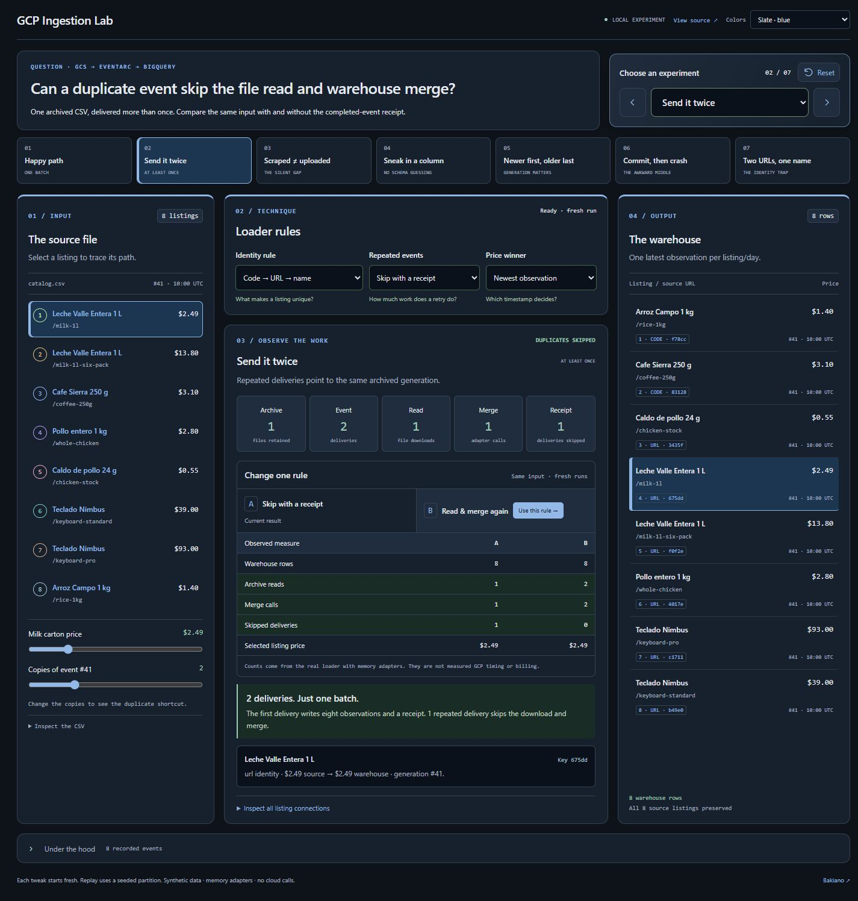
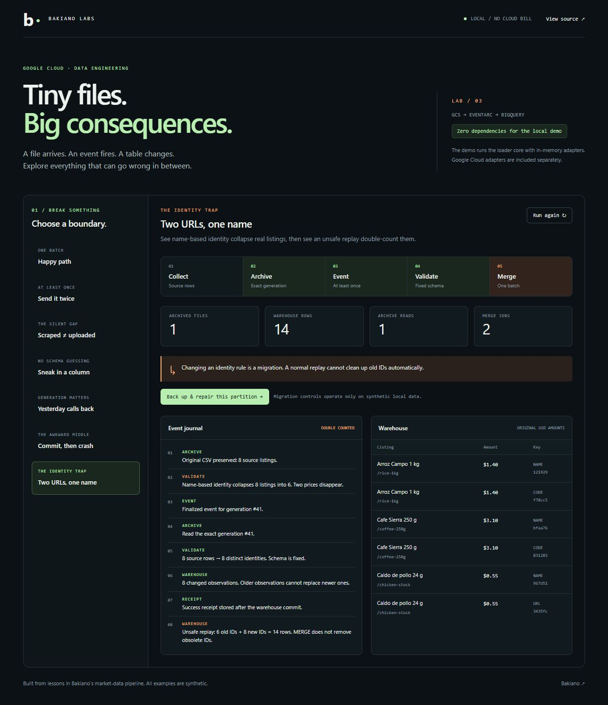
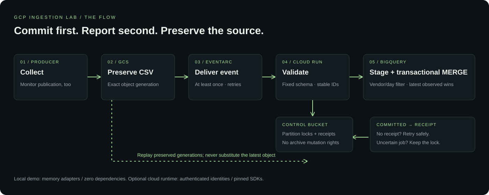

# GCP Ingestion Lab

A runnable lab for the failure boundaries in **Cloud Storage → Eventarc → Cloud Run → BigQuery**. Compare one loader rule at a time, inspect the operations it performs, and verify the resulting rows.

[](https://github.com/alejandrofrank/gcp-ingestion-lab/actions/workflows/ci.yml)
[](LICENSE)



Use **Colors** in the header to try Slate / blue, Graphite / grey or Midnight / blue. The selection is saved locally and does not restart an experiment. Outcome colors retain their meaning. [Palette controls](docs/palettes.md).

## Run it in 15 seconds

Requires Node.js 22 or later. No installation step, credentials, API key or cloud account:

```sh
git clone https://github.com/alejandrofrank/gcp-ingestion-lab.git
cd gcp-ingestion-lab
npm run dev
```

Open **http://127.0.0.1:4313**.

The browser calls the real loader core with **in-memory adapters and synthetic fixtures**. Each tweak starts fresh; identity replay seeds an earlier partition explicitly. Cloud timing, billing and IAM behavior are not emulated. The upload-denial scenario injects an error; it does not change any permissions.

Start with **Send it twice**. The question describes the input; the center compares the current receipt rule with its opposite. Both runs return eight rows, but one downloads and merges the file twice. Click **Use this rule** to make the other result current.

Read the workspace **left → center → right**: source listings, rules and measured adapter operations, then current warehouse output. Pick a listing to compare its retained price in A and B. Change the milk price or delivery count to rerun both sides with the same input. The identity cases compare name-only keys with stable keys; the late-arrival case compares observation time with arrival order. Publication and schema failures show their stopping boundary because toggling a downstream rule cannot repair them.

CSV, the full connection graph and the event journal are expandable evidence. The workbench has keyboard focus states, responsive layouts and reduced-motion support. Counts and prices come from loader executions, not a canned animation. See [how the comparisons work](docs/workbench.md).

The lossy name rule, repeated-read adapter and last-arrival price rule live in `examples/techniques.js` for comparison. The cloud receiver uses the safe defaults and does not accept browser experiment settings.

```sh
npm test        # Core invariants and mocked GCP adapter contracts
npm run demo   # All seven scenarios without a browser
npm run bench  # Bounded local throughput check; no cloud calls
```

## The interesting bits

| Try this | What happens | Why it matters |
|---|---|---|
| **Send it twice** | 8 rows, 1 archive read, 1 merge | A duplicate delivery finds the durable receipt before downloading or submitting warehouse work. |
| **Scraped ≠ uploaded** | 8 collected, 0 published, 0 events | A successful collector is not proof of a successful publication. An event handler cannot see an event that never existed. |
| **Sneak in a column** | File retained, table unchanged | The CSV cannot supply its own `product_id` or silently change the warehouse schema. |
| **Newer first, older last** | Older event arrives last; newer price survives | Load the event's exact object generation. Compare observation timestamps, not delivery order. |
| **Commit, then crash** | Retry re-reads, but inserts no duplicates | Warehouse commit and receipt write are separate boundaries. The MERGE remains safe if reporting fails. |
| **Two URLs, one name** | **8 → 6 → 14 → 8** | Name identity collapses distinct listings. Replaying under new IDs double-counts. An explicit migration repairs the partition. |

The identity controls are intentionally dramatic: **Replay with stable IDs** exposes the duplication; **Back up & repair** performs an in-memory backup and replaces only the synthetic vendor/day. This is a teaching example, not a deployed repair endpoint. See the [migration checklist](docs/operations.md#changing-identity).



## Small by design

- **Zero runtime dependencies for the local lab.** Native HTTP, CSV parsing and Node's test runner. No frontend build step or external fonts.
- **Bounded input:** 1 MiB, 10,000 rows, fixed columns and bounded fields. Larger files fail explicitly.
- **One batch per file:** one exact-generation download, one staging load and one transactional warehouse script. No row-by-row cloud requests.
- **Partition-aware writes:** the target is filtered by observation day and vendor; clustered by vendor/product ID. The query has a 100 MB billing cap, which is a ceiling, not a measured cost.
- **Duplicate shortcut:** a completed receipt avoids source download, staging and MERGE. Lock and receipt operations still happen.
- **Only the cloud runtime gets SDK dependencies.** Pinned SDKs and a separate lockfile live in `cloud/`.

The local `MERGE JOBS` counter measures calls to the in-memory merge adapter. A real BigQuery script can create child jobs, and the staging load is separate. The cloud adapter returns an unknown changed-row count instead of inventing one.

## Architecture



1. A producer publishes an immutable CSV under `domain/vendor/YYYY/MM/DD/file.csv`.
2. Eventarc delivers a finalized event. The receiver validates the configured bucket, vendor, path and generation.
3. A vendor/day lock serializes writers. A prior receipt makes the delivery a cheap no-op.
4. The loader downloads the **specific generation**, validates UTF-8 and the fixed schema, and computes identities.
5. One staging table receives the normalized batch. A transaction rejects conflicting equal-time prices and merges newer observations.
6. Only after commit does the loader record success. Invalid inputs get their own receipt; raw files remain in the archive.

The loader's identity rule is **code → URL → name**, scoped to a vendor. Literal `NULL` is missing, not a product code. Identity is an identifier for a source listing, not cross-vendor product matching.

The table stores one latest observation per **vendor/product/day**. It does not retain every intraday price tick. Original CSV generations are the replay source. Amounts retain their source currency; there is no guessed conversion or unit normalization.

## Optional Google Cloud setup

The [cloud guide](docs/cloud.md) contains the pinned Docker runtime, IAM boundaries, Terraform configuration and smoke-test procedure. Everything stays in one region. The loader scales to zero and accepts authenticated Eventarc requests.

**Verification boundary:** the core and cloud contracts run offline; CI builds the SDK container and validates Terraform. This repository has not been deployed as a live end-to-end GCP test. It creates no cloud resources when you run the demo or tests.

## Where to read the code

| File | Responsibility |
|---|---|
| [src/csv.js](src/csv.js) | Bounded CSV parser and fixed column contract |
| [src/engine.js](src/engine.js) | Event binding, validation, identity and commit/receipt ordering |
| [src/memory.js](src/memory.js) | Deterministic local archive and atomic warehouse adapter |
| [src/gcp.js](src/gcp.js) | Exact-generation GCS reads, durable locks/receipts and BigQuery batch MERGE |
| [examples/scenarios.js](examples/scenarios.js) | Seven failures you can inspect |
| [examples/techniques.js](examples/techniques.js) | Bounded local tweaks and deliberately unsafe comparison adapters |
| [docs/operations.md](docs/operations.md) | Replay, orphan locks, identity changes and publication monitoring |
| [terraform/main.tf](terraform/main.tf) | Region-aligned, protected archive, table and authenticated receiver |

## From Bakiano

Inspired by engineering lessons from [Bakiano](https://bakiano.com), a Venezuelan market-intelligence platform. This is newly authored demonstration code with invented listings and source URLs under `example.test`. No production datasets, private infrastructure configuration or credentials are included.

Related labs: [bigquery-query-guard](https://github.com/alejandrofrank/bigquery-query-guard) · [catalog-match-lab](https://github.com/alejandrofrank/catalog-match-lab).

## Sources and limits

Event delivery is at least once, not an exactly-once promise: [Eventarc retries](https://docs.cloud.google.com/eventarc/docs/retry-events). MERGE semantics follow the [BigQuery DML reference](https://docs.cloud.google.com/bigquery/docs/reference/standard-sql/dml-syntax#merge_statement). The infrastructure follows [Google's Eventarc Terraform guide](https://docs.cloud.google.com/eventarc/docs/creating-triggers-terraform), with protected archives and retries enabled.

This is a bounded ingestion lab, not a complete production platform. It omits a collector, expected-publication monitor, dead-letter queue, automatic lock recovery and automated identity migration. The [operations guide](docs/operations.md) describes the gaps explicitly.

MIT licensed.
