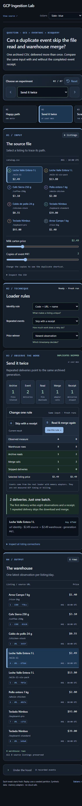

# Reading the workbench

The header poses one concrete failure question. The source file is on the left, the configurable loader and its work are in the center, and the current warehouse result is on the right.

The default duplicate experiment has two deliveries of one archived generation. A uses the selected receipt setting. B flips only that setting; identity, timestamp handling, price and delivery count stay the same. Both results come from independent fresh executions of the loader with memory adapters.

| Experiment | Variable compared | Evidence to inspect |
|---|---|---|
| Happy path / two URLs | Stable keys versus name-only keys | Eight versus six rows; the selected source URL can disappear |
| Duplicate / receipt failure | Check completed receipts versus repeat the work | Reads, merges and skipped deliveries; a failed receipt cannot skip the first retry |
| Older event arrives last | Observation time versus last arrival | Selected carton price is $2.19 versus $2.49 with the default input |
| Upload failure | No downstream alternative | No archive object, event, read or merge |
| Invalid schema | No downstream alternative | File retained and read; no merge |

**Use this rule** applies B's setting to the current run. The right-hand warehouse always displays A. Selecting a source listing updates the price row in both comparisons and highlights the corresponding current warehouse row.

The operation strip counts retained archive generations, delivered events, archive downloads, merge-adapter calls and deliveries skipped after finding a receipt. These are per-result counts, not the combined work of rendering A and B. A real BigQuery staging load and script child jobs are separate cloud operations. The lab makes no claim about cloud runtime or billed cost.

## Identity migration

The replay and repair controls use an explicitly seeded name-based partition. Replay leaves six old keys beside eight stable keys. Repair snapshots those fourteen rows and replaces only the synthetic vendor/day partition with the eight archived listings. The ordinary one-rule comparison is hidden during these migration steps because they change stored state, not just an option.

## Inspection and boundaries

Expand the CSV to inspect raw bytes, the connection diagram to trace all keys, or the journal to inspect ordering. Source selection uses real URLs and derived identities. No prices or outcomes are invented for the interface.

Each edit starts fresh. All listings are synthetic; local adapters are not a cloud emulator. The unsafe comparison rules cannot be supplied to the deployed cloud receiver.

See the [capture recipes](screenshots.md) when refreshing the UI images.
